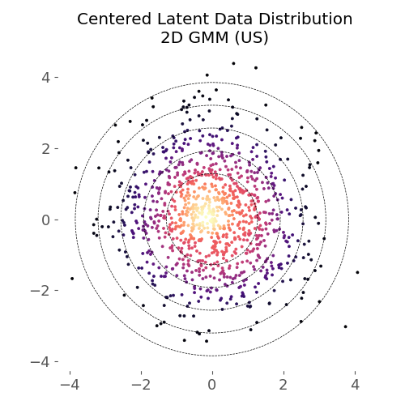
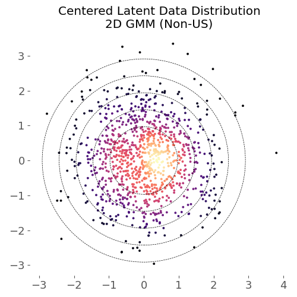
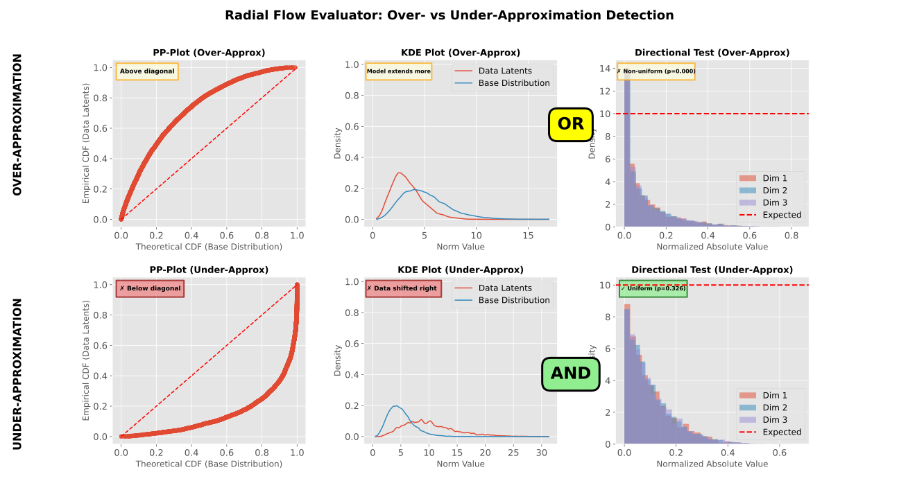

# CJD-Flows: Constant-Jacobian-Determinant Flows

CJD-Flows is a Python library for building and evaluating flow-based density estimators with a guaranteed constant Jacobian determinant. In this repository, we use **US flows** (uniformly scaling flows) as the term for the broader model class, and **CJD-Flows** as the library name.

The library is designed for applications that benefit from stable training, exact likelihoods, and predictable latent level-set geometry.

## Used libraries


## Citation

If you use this library, please cite the VeriFlow paper:

> Zaid, F. A., Neider, D., and Yalciner, M. (2026). VeriFlow: Modeling Distributions for Neural Network Verification. *Proceedings of the AAAI Conference on Artificial Intelligence*, 40(33), 28050-28058. https://doi.org/10.1609/aaai.v40i33.40030

GitHub citation support and downloadable formats:

- [`CITATION.cff`](CITATION.cff) (for GitHub's "Cite this repository" widget)
- [`CITATION.bib`](CITATION.bib) (downloadable BibTeX)

<details>
<summary>BibTeX</summary>

```bibtex
@article{Zaid_Neider_Yalciner_2026,
  title   = {VeriFlow: Modeling Distributions for Neural Network Verification},
  author  = {Zaid, Faried Abu and Neider, Daniel and Yal{\c{c}}iner, Mustafa},
  journal = {Proceedings of the AAAI Conference on Artificial Intelligence},
  volume  = {40},
  number  = {33},
  pages   = {28050--28058},
  year    = {2026},
  month   = mar,
  doi     = {10.1609/aaai.v40i33.40030},
  url     = {https://ojs.aaai.org/index.php/AAAI/article/view/40030}
}
```

</details>

## Core features

- Exact and efficient `log_prob` evaluation and sampling.
- Uniformly scaling architectures with constant Jacobian determinant.
- Piecewise-affine behavior for additive-coupling architectures with (leaky-)ReLU conditioners.
- UDL-preserving structure, enabling interpretable level-set mappings between latent and data spaces.
- Scalable conditioner networks, from piecewise-affine CNNs/MLPs to a Jet-style vision transformer with a global receptive field.
- ONNX export support for inference graphs (`log_prob` and sampling).

## Latent-space alignment

Uniformly scaling flows preserve upper density level sets: data-space density level
sets map onto latent norm level sets. The 2D GMM example below shows latent
representations colored by the data density. For the US flow (left), the density
decreases monotonically with the latent norm and aligns with the concentric level
sets of the base distribution. For a non-US flow (right), high-density regions are
skewed against the latent level-set geometry, so latent norms carry no reliable
density information.

<p align="center">
  
  
</p>

This alignment is what makes latent upper density level sets (UDLs) meaningful
proxies for data-space density level sets — the basis for the verification and
anomaly-detection applications below.

## Architecture overview

CJD-Flows provides a modular implementation of US-flow components:

- Flow models and building blocks in `src/cjd_flows/flows.py`.
- Affine and coupling transforms in `src/cjd_flows/transforms.py`.
- Conditioner networks in `src/cjd_flows/networks.py`.
- Flexible base distributions in `src/cjd_flows/distributions.py`, including radial distributions for `L1`, `L2`, and `Linf` geometries.

A key component is the **learnable radial norm distribution** (including mixture families), which closes an important expressivity gap for uniformly scaling flows while keeping latent geometry controllable.

### Conditioners

Additive couplings have unit Jacobian determinant *regardless of the conditioner*,
so arbitrary modeling capacity can be spent on the conditioner network without
losing the constant-Jacobian-determinant property. The library provides:

| Conditioner | Input topology | Piecewise affine |
|---|---|---|
| `ConvNet` / `CondConvNet` | vector, 1–3D spatial | with (leaky-)ReLU nonlinearity |
| `JetConditioner` | vector, 1–3D spatial, sequences | no |

`JetConditioner` is a scalable ViT-style transformer conditioner following the Jet
architecture (Kolesnikov et al., 2024): patchified tokens, pre-LN attention blocks
with QK-normalization, and a zero-initialized output head so every coupling layer
starts as the identity. All linear maps act independently per token; self-attention
is the only cross-token operation and provides a global receptive field in a single
coupling layer. Context variables (e.g. the soft-training noise scale) are injected
via adaLN-zero modulation. The trunk is domain-agnostic: sequence data is supported
through `in_dims=[C, L]` with optional causal attention and padding masks
(sequence length is fixed at construction).

Note on piecewise affinity: with (leaky-)ReLU nonlinearities, the CNN/MLP
conditioners keep the whole flow piecewise affine, which enables exact,
SMT/MILP-based verification. The transformer conditioner is smooth rather than
piecewise affine (softmax attention, GELU, LayerNorm), so it is out of reach for
exact SMT encodings; abstract-interpretation-based verifiers such as
alpha-beta-CROWN, however, handle transformer architectures via bound propagation,
so verification workflows remain possible. It is also the natural choice for
density estimation and anomaly detection, where no verifier is involved.

## Evaluation suite

The evaluation module in `src/cjd_flows/explib/eval.py` is tailored to radial-base US flows and includes:

- norm-distribution diagnostics (KS, Wasserstein, PP/QQ/KDE),
- radiality diagnostics (sign symmetry and simplex-uniformity tests),
- calibration-oriented latent-space analysis,
- fine-grained mismatch diagnostics that help distinguish over- vs. under-approximation of density level sets.



## Installation

Assuming the package is published on PyPI:

```bash
pip install cjd-flows
```

## Applications

CJD-Flows is intended as a general-purpose density-modeling library. We are currently expanding application examples and will add more soon.

### Example: Neural network verification

One current use case is verification with distribution-aware input restrictions:

- train a US flow as a proxy density model of valid inputs,
- define latent upper density level sets (UDLs),
- map these sets through the flow to input-space constraints,
- verify properties (e.g., robustness/fairness) over likely inputs.

For verification workflows, the library also provides simplification methods that transform trained flow models into verifier-friendly fully connected or convolutional network forms to maximize compatibility with existing tools.

This turns flow density estimates into practically usable constraints for symbolic and abstract verification pipelines.

### Example: Anomaly detection

Because the Jacobian determinant is constant, latent norms are monotone in the data
density: a sample is anomalous exactly when its latent representation falls outside
a chosen norm level set. This gives calibrated, threshold-based anomaly scores
directly from the latent space — no likelihood-ratio tricks required. High-capacity
conditioners such as `JetConditioner` can be used freely here, since piecewise
affinity is not needed for this use case.

## Experiments

The repository includes a lightweight YAML-based experiment framework.

```bash
python scripts/run-experiment.py --config <config file> --report_dir <log dir>
```

## Acknowledgment

<picture>
  <source media="(prefers-color-scheme: dark)" srcset="docs/images/logos/baiaa-logo.svg">
  
</picture>

The Bavarian AI Act Accelerator is a two-year project funded by the Bavarian
State Ministry of Digital Affairs to support SMEs, start-ups, and the public
sector in Bavaria in complying with the EU AI Act. Under the leadership of the
appliedAI Institute for Europe and in collaboration with Ludwig Maximilian
University, the Technical University of Munich, and the Technical University of
Nuremberg, training, resources, and events are being offered. The project
objectives include reducing compliance costs, shortening the time to compliance,
and strengthening AI innovation. To achieve these objectives, the project is
divided into five work packages: project management, research, education, tools
and infrastructure, and community.
